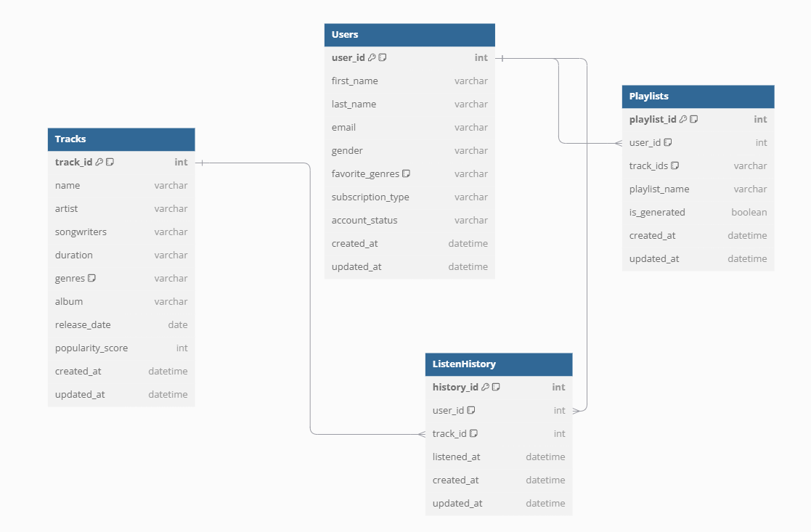
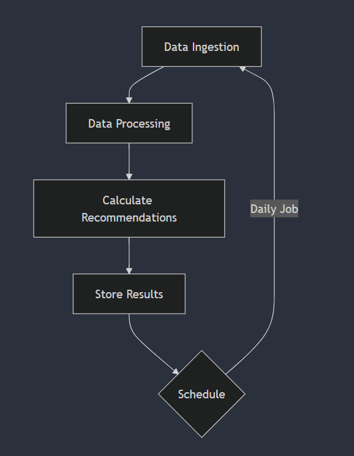
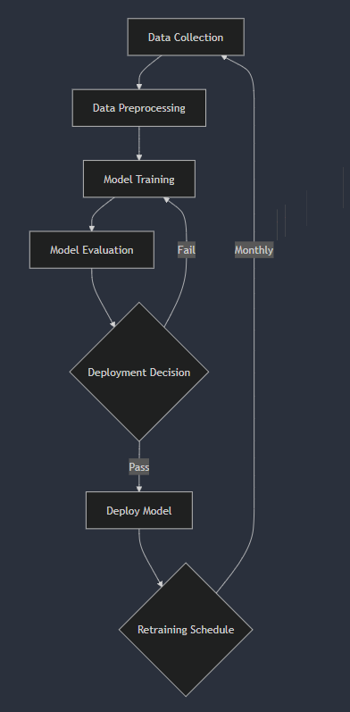

# Réponses du test

## _Utilisation de la solution (étape 1 à 3)_

Pour configurer et exécuter le pipeline de données :

### Instruction 1 : Cloner le dépôt et naviguer vers le répertoire du projet:

Pour commencer, suivez ces étapes détaillées pour cloner le dépôt du projet :

1. **Ouvrir le Terminal :**
   - Sur macOS ou Linux, ouvrez l’application Terminal.
   - Sur Windows, ouvrez PowerShell ou l'Invite de commandes.
   - Sinon, vous pouvez aussi ouvrir Git Bash (recommendé)
2. **Naviguer vers le Répertoire de Destination :**

   - Utilisez la commande `cd` pour vous déplacer vers le dossier où vous souhaitez stocker le projet. Par exemple :
     ```bash
     cd /chemin/vers/votre/dossier/projet
     ```
   - Remplacez `/chemin/vers/votre/dossier/projet` par le chemin de votre choix.

3. **Cloner le Dépôt :**

   - Si vous avez l'URL du dépôt Git (généralement trouvée sur la page du projet GitHub ou GitLab), copiez-la.
   - Dans le terminal, exécutez la commande suivante pour cloner le dépôt :
     ```bash
     git clone <URL_du_dépôt>
     ```
   - Remplacez `<URL_du_dépôt>` par l’URL réelle du dépôt.

4. **Naviguer vers le Répertoire du Projet :**
   - Après avoir cloné le dépôt, entrez dans le répertoire du projet nouvellement créé :
     ```bash
     cd nom_du_projet
     ```
   - Remplacez `nom_du_projet` par le nom du dossier du projet (le nom peut correspondre au nom du dépôt).

---

### Instruction 2 : Créer un environnement virtuel et installer les dépendances

Suivez ces étapes pour configurer l'environnement virtuel et installer les dépendances nécessaires :

1. **Créer un Environnement Virtuel :**

   - Dans le répertoire du projet, exécutez cette commande pour créer un environnement virtuel :
     ```bash
     python -m venv venv
     ```

2. **Activer l’Environnement Virtuel :**

   - Activez l’environnement virtuel pour isoler les installations de packages. Utilisez la commande appropriée selon votre système d’exploitation :
     - Sur macOS/Linux (Terminal ou Git Bash) :
       ```bash
       source venv/bin/activate
       ```
     - Sur Windows (Powershell ou Command Line) :
       ```bash
       venv\Scripts\activate
       ```
     - Sur Windows (Git Bash) :
       ```bash
       source venv/Scripts/activate
       ```

3. **Installer les Dépendances :**
   - Avec l’environnement virtuel activé, installez les dépendances nécessaires en utilisant le fichier `requirements.txt` :
     ```bash
     pip install -r requirements.txt
     ```

---

### Instruction 3 : Démarrer le serveur FastAPI

Pour lancer le serveur, suivez ces étapes :

1. **Naviguer vers le Répertoire de l'Application FastAPI :**

   - Allez dans le répertoire `src/moovitamix_fastapi` où l’application FastAPI est située :
     ```bash
     cd src/moovitamix_fastapi
     ```

2. **Démarrer le Serveur :**

   - Utilisez la commande suivante pour lancer le serveur avec `uvicorn` en mode rechargement automatique :
     ```bash
     python -m uvicorn main:app --reload
     ```
   - Cette commande démarre le serveur et vous permet de voir les modifications instantanément sans redémarrer manuellement le serveur.

3. **Vérifier l'Accès à l’Application :**
   - Une fois le serveur en cours d’exécution, accédez à la documentation interactive de l'API en ouvrant un navigateur et en visitant :
     [http://127.0.0.1:8000/docs](http://127.0.0.1:8000/docs)

---

### Instruction 4 : Exécuter le pipeline de données

Pour exécuter le pipeline de données et récupérer les données nécessaires, suivez ces étapes :

1. **Ouvrir un Nouveau Terminal et Accéder au Répertoire du Projet :**

   - Ouvrez un nouveau terminal et accédez au répertoire principal de votre projet :
     ```bash
     cd /chemin/vers/votre/projet
     ```

2. **Exécuter le Pipeline de Données :**

   - Lancez le script de pipeline de données avec la commande suivante :
     ```bash
     python data_pipeline.py
     ```
   - Ce script va récupérer les données à partir des points de terminaison de l’API et les enregistrer sous forme de fichiers JSON dans le dossier `data/`.

3. **Vérifier les Données Générées :**
   - Allez dans le dossier `data/` pour vérifier que les fichiers JSON ont bien été créés et contiennent les données récupérées.

---

## Questions (étapes 4 à 7)

### Étape 4

# Schéma de Base de Données et Recommandation de Système

## Recommandation de Système de Base de Données :

Je recommande l’utilisation d’une base de données NoSQL comme MongoDB pour les raisons suivantes :

### Avantages de NoSQL par rapport à SQL :

- **Schéma Flexible** : Les bases de données NoSQL, en particulier celles basées sur des documents comme MongoDB, gèrent facilement les données semi-structurées (par exemple, JSON). Cette flexibilité est avantageuse lorsque les champs de données peuvent varier ou nécessiter des changements rapides.
- **Scalabilité** : Les bases de données NoSQL sont conçues pour un passage à l'échelle horizontal, ce qui les rend idéales pour gérer de grands ensembles de données et traiter des volumes de trafic élevés avec un impact minimal sur la performance.
- **Performances Élevées en Écriture et Lecture** : Compte tenu du besoin d'ingestion quotidienne, NoSQL est optimisé pour des écritures et lectures rapides, garantissant une disponibilité rapide des données pour le système de recommandation.

### Pourquoi NoSQL plutôt que SQL pour ce Cas d'Utilisation :

- **Moins de Rigidité** : Étant donné que le pipeline de données ingère des données provenant de divers points d'extrémité, la flexibilité d'une base de données NoSQL permet un stockage sans contraintes de schéma strictes, réduisant la surcharge lorsque les champs ou les types de données changent.
- **Facilité d'Intégration avec JSON** : MongoDB stocke les données dans un format proche de JSON (BSON), ce qui simplifie l’ingestion et l’interrogation des données déjà structurées de manière similaire, comme les réponses d’API.

### Inconvénients de NoSQL pour ce Cas d'Utilisation :

- **Requêtes Complexes et Jointures** : Les bases de données NoSQL ne sont pas optimisées pour des jointures complexes ou des requêtes multi-tables, ce qui peut limiter les capacités de requête par rapport aux bases de données SQL. Par exemple, analyser les motifs d'interaction des utilisateurs sur plusieurs tables pourrait être plus simple dans une base de données relationnelle.
- **Problèmes de Cohérence** : Les bases de données NoSQL privilégient généralement la disponibilité et la tolérance aux partitions par rapport à la cohérence immédiate, ce qui peut introduire des délais dans les mises à jour de données. Pour des besoins critiques en temps réel, cela peut constituer une limitation.

### Conclusion

Compte tenu des objectifs du projet et du besoin d'une ingestion quotidienne de données efficace et évolutive, les avantages de MongoDB l'emportent sur les limitations, en faisant un choix solide pour ce scénario.
<br><br>

<div style="display: flex; justify-content: space-between;">

<div style="width: 48%; padding-right: 2%; border-right: 1px solid #ccc;">

## Schéma de Base de Données MongoDB Proposé

### Collection Tracks

Chaque document représente une chanson.

- `track_id` : Identifiant unique pour chaque chanson (ou `_id` de MongoDB).
- `name` : Titre de la chanson.
- `artist` : Nom de l'artiste.
- `songwriters` : Nom(s) du ou des auteurs-compositeurs.
- `duration` : Durée de la chanson au format HH:MM:SS.
- `genres` : Liste des genres associés à la chanson (intégré dans chaque document pour éviter des relations).
- `album` : Nom de l'album.
- `release_date` : Date de sortie de la chanson.
- `popularity_score` : Score de popularité pour faciliter les recommandations.
- `created_at` : Date de création de l'entrée de la chanson.
- `updated_at` : Dernière date de mise à jour de l'entrée de la chanson.

### Collection Users

Chaque document représente un utilisateur.

- `user_id` : Identifiant unique pour chaque utilisateur (ou `_id` de MongoDB).
- `first_name` : Prénom de l'utilisateur.
- `last_name` : Nom de l'utilisateur.
- `email` : Adresse e-mail de l'utilisateur.
- `gender` : Genre de l'utilisateur.
- `favorite_genres` : Liste des genres préférés de l'utilisateur (intégré pour optimiser les requêtes).
- `subscription_type` : Type d'abonnement (ex. : gratuit, premium).
- `account_status` : Statut actuel du compte (ex. : actif, suspendu).
- `created_at` : Date de création du compte utilisateur.
- `updated_at` : Dernière date de mise à jour du compte.

### Collection ListenHistory

Chaque document suit une interaction d'un utilisateur avec une chanson.

- `history_id` : Identifiant unique pour chaque enregistrement d'écoute (ou `_id` de MongoDB).
- `user_id` : Référence à `user_id` dans la collection Users.
- `track_id` : Référence à `track_id` dans la collection Tracks.
- `listened_at` : Date et heure d'écoute de la chanson.
- `created_at` : Date de création de l'enregistrement d'écoute.
- `updated_at` : Dernière date de mise à jour de l'enregistrement.

### Collection Playlists

Chaque document représente une playlist créée ou générée automatiquement.

- `playlist_id` : Identifiant unique pour chaque playlist (ou `_id` de MongoDB).
- `user_id` : Référence à `user_id` dans la collection Users.
- `track_ids` : Liste des identifiants de chansons dans la playlist (intégré pour simplifier la récupération).
- `playlist_name` : Nom de la playlist.
- `is_generated` : Indique si la playlist a été générée automatiquement.
- `created_at` : Date de création de la playlist.
- `updated_at` : Dernière date de mise à jour de la playlist.

</div>

<div style="width: 48%; padding-left: 2%;">

## Schéma de Base de Données MongoDB Proposé avec Explications

### Choix du Schéma et Justification

Ce schéma est conçu pour MongoDB afin de maximiser la performance, la flexibilité et la facilité de récupération de données. Chaque collection est pensée pour répondre aux besoins d'ingestion et de récupération rapide de données, tout en permettant des relations flexibles entre les entités.

### Collection Tracks

Chaque document représente une chanson et contient des informations de base et des métadonnées utiles pour les recommandations.

- **Pourquoi** : La collection `Tracks` regroupe toutes les informations de la chanson, ce qui simplifie la récupération des détails de la piste sans nécessiter de jointures complexes.
- **Optimisation des requêtes** : Les genres sont intégrés directement sous forme de liste dans chaque document, ce qui permet de récupérer les informations de genre sans effectuer de requêtes supplémentaires. Cette structure est idéale pour des recommandations rapides basées sur le genre ou la popularité.
- **Relation** : Les documents dans `ListenHistory` et `Playlists` référencent `track_id`, ce qui permet une connexion facile entre les interactions des utilisateurs et les pistes spécifiques.

### Collection Users

Chaque document représente un utilisateur unique avec ses informations et ses préférences.

- **Pourquoi** : La collection `Users` centralise toutes les données utilisateur, y compris les genres préférés et le type d'abonnement. Cela permet une personnalisation rapide et des filtres basés sur les préférences de l'utilisateur.
- **Optimisation des requêtes** : Les genres préférés de l'utilisateur sont intégrés sous forme de liste, ce qui rend la récupération rapide pour les recommandations personnalisées.
- **Relation** : Le `user_id` est référencé dans `ListenHistory` et `Playlists`, facilitant l'association de chaque interaction avec les données utilisateur.

### Collection ListenHistory

Chaque document enregistre une interaction de l'utilisateur avec une chanson spécifique, avec un timestamp pour le suivi des habitudes d'écoute.

- **Pourquoi** : `ListenHistory` est une collection d'historique indépendante, permettant de stocker un grand volume de données d'interaction sans surcharge des collections `Tracks` ou `Users`.
- **Optimisation des requêtes** : Cette structure permet de récupérer les habitudes d'écoute d'un utilisateur rapidement pour des analyses de tendance et des recommandations basées sur l'historique d'écoute.
- **Relation** : `user_id` et `track_id` permettent de relier les écoutes aux utilisateurs et aux pistes, offrant une vue complète de l'interaction utilisateur pour des analyses avancées.

### Collection Playlists

Chaque document représente une playlist créée ou générée automatiquement pour un utilisateur, comprenant les pistes et les métadonnées de la playlist.

- **Pourquoi** : `Playlists` permet de stocker des listes de chansons associées à un utilisateur, optimisant les recommandations et les playlists personnalisées.
- **Optimisation des requêtes** : Les identifiants de pistes (`track_ids`) sont intégrés dans la playlist, permettant une récupération rapide des listes de lecture sans besoin de jointures. Ceci est idéal pour afficher des playlists personnalisées en temps réel.
- **Relation** : `user_id` relie la playlist à un utilisateur, et `track_ids` stocke les pistes associées à la playlist, créant un lien direct entre les utilisateurs et leurs playlists.

### Résumé des Avantages du Schéma MongoDB

1. **Récupération Optimisée** : Les listes intégrées (genres, pistes dans une playlist) permettent de minimiser les requêtes complexes et d'améliorer les temps de réponse.
2. **Flexibilité des Relations** : Plutôt que de contraindre les données avec des clés étrangères strictes, chaque collection peut croître de manière indépendante tout en maintenant des liens logiques à l'aide de références (`user_id`, `track_id`).
3. **Scalabilité** : En structurant les données en collections indépendantes et optimisées pour la récupération, le schéma peut évoluer facilement pour répondre à des volumes de données croissants, notamment dans `ListenHistory`.

Ce schéma maximise la performance et l'adaptabilité tout en conservant une structure claire et efficace pour le traitement de données volumineuses dans un environnement MongoDB.

</div>

</div>

---

<div align="center">
  
  <h4>Diagramme 1: Présentation Visuelle de la BD</h4>
</div>

> **Note**:  
> Ce schéma est créé pour visualiser la structure de notre base de données NoSQL dans MongoDB, bien qu’il ne représente pas une base SQL classique avec des clés primaires et étrangères.  
> Les collections _Tracks_, _Users_, _ListenHistory_, et _Playlists_ sont structurées pour optimiser la flexibilité et l’efficacité de la récupération des données dans MongoDB.  
> Les références (`user_id`, `track_id`) sont logiques et non strictement appliquées comme dans les bases SQL, permettant une gestion plus dynamique des relations entre les documents sans contraintes imposées.

---

### Étape 5

# Surveillance du Pipeline

Pour garantir la fiabilité et la santé du pipeline de données, les métriques de surveillance et alertes suivantes peuvent être mises en place :

## Métriques Clés :

- **Taux de Succès de Récupération de Données** : Suivre le nombre d'appels API réussis par rapport aux échecs, en capturant tout temps d'arrêt ou problème d'accès. Cela peut être visualisé sous forme de ratio succès/échec pour identifier facilement toute interruption de service.
- **Temps d'Exécution** : Mesurer le temps nécessaire pour récupérer et sauvegarder les données afin de surveiller les problèmes de performance. La journalisation de l'heure de début et de fin de chaque exécution peut mettre en évidence une dégradation des performances et indiquer des problèmes potentiels liés à l'API ou à la vitesse du réseau.
- **Taux d'Erreur** : Enregistrer et surveiller le nombre et les types d'erreurs rencontrées lors de la récupération et du stockage des données. Cela aide à identifier les points de défaillance spécifiques, comme des formats de données invalides ou des problèmes de stockage.
- **Volume de Données** : Suivre le volume de données récupérées depuis chaque point d'accès. Des écarts significatifs par rapport au volume de données attendu peuvent indiquer des enregistrements manquants ou dupliqués.
- **Détection d'Anomalies en Temps Réel** : Détecter automatiquement les anomalies de volume ou de qualité de données pour agir immédiatement.
- **Analyse Historique** : Suivre les tendances de performance de l'API pour optimiser les appels et identifier les faiblesses potentielles.

## Alertes :

Mettre en place des alertes automatisées (par exemple, en utilisant des outils de surveillance comme Prometheus ou des frameworks de journalisation personnalisés) pour :

- **Taux d'Erreur Élevé** : Notifier l'équipe si le taux d'erreurs dépasse un seuil prédéfini dans une fenêtre de temps spécifiée. Cela peut être configuré pour alerter sur les erreurs critiques ou sur l'accumulation de problèmes mineurs.
- **Augmentation du Temps d'Exécution** : Déclencher des alertes si le temps d'exécution du pipeline dépasse systématiquement un seuil défini, ce qui indique des problèmes de performance potentiels.
- **Anomalies de Volume de Données** : Configurer des alertes pour notifier l'équipe en cas d'augmentation ou de diminution significative du volume de données, suggérant une duplication ou une perte de données.
- **Métriques de Qualité de Données** : Configurer des alertes en cas de données incomplètes ou d'erreurs de précision pour garantir la fiabilité du pipeline.

## Agrégation et Stockage des Journaux :

Pour suivre les tendances dans le temps, agréger les journaux dans un système de journalisation centralisé (par exemple, ELK Stack ou Splunk). Cela fournit des données historiques pour aider à diagnostiquer les problèmes récurrents et à optimiser les performances du pipeline.

## Récupération Automatisée :

Configurer des tentatives de récupération automatique en cas d'erreurs transitoires, réduisant ainsi l'intervention manuelle. Pour les problèmes persistants, ajouter des mécanismes de secours ou des escalades d'alerte pour garantir la continuité des données.

## Suivi de l'Impact Métier :

Surveiller la couverture utilisateur et la fraîcheur des recommandations pour vérifier que les données restent pertinentes pour les utilisateurs en temps réel.

---

### Étape 6

# Automatisation des Calculs de Recommandation

Pour automatiser les calculs quotidiens de recommandations pour les playlists personnalisées, l'approche suivante peut être mise en œuvre :

## Planification de la Tâche de Calcul :

- Utiliser un planificateur comme cron (sur Linux) ou un planificateur de tâches (sur Windows) pour déclencher automatiquement un script Python chaque jour. Ce script récupérera les dernières données d'écoute des utilisateurs et effectuera les calculs de recommandation.
- Alternativement, un outil d'automatisation de workflows tel qu'Apache Airflow ou Prefect peut gérer la planification et le suivi du succès ou de l'échec de chaque tâche de calcul. Ces outils offrent une approche plus évolutive pour la gestion des workflows complexes.

## Déroulement du Processus :

- Le job de calcul exécutera des scripts de traitement de données pour générer des recommandations en utilisant les données les plus récentes de comportement des utilisateurs (à partir de `listen_history`).
- Pour chaque utilisateur, il calculera une playlist personnalisée en analysant les motifs de leur historique d'écoute, les genres préférés et l'activité récente.
- Le job stockera les recommandations dans un emplacement de sortie dédié, comme une collection séparée dans la base de données ou une couche de cache facilement accessible (par exemple, Redis), les rendant disponibles pour une récupération en temps réel.

## Gestion des Erreurs et Journalisation :

- Mettre en place une journalisation pour chaque calcul afin de suivre les échecs ou anomalies, garantissant que le calcul des recommandations de chaque utilisateur est enregistré et que les erreurs sont signalées pour un dépannage rapide.
- Des tentatives automatiques peuvent être configurées en cas d'erreurs mineures ou d'interruptions afin de prévenir les lacunes de données.

## Optimisation de la Performance :

- Traiter les utilisateurs en lots pour optimiser les performances du moteur de recommandations, en particulier si le nombre d'utilisateurs est important.
- Utiliser la mise en cache pour accélérer les recommandations souvent demandées, réduisant ainsi les recalculs.
- Mettre en place des mises à jour incrémentielles pour éviter les recalculs complets, optimisant ainsi les ressources.

## Stratégies de Test et Fiabilité :

- Intégrer un framework de tests A/B pour expérimenter avec différents algorithmes de recommandation.
- Définir des recommandations de secours pour les utilisateurs sans historique afin d'éviter les scénarios de démarrage à froid.

<div align="center">
  
  <h4>Diagramme 2: Flowchart de l'Automatisation des Calculs</h4>
</div>

---

### Étape 7

# Automatisation du Réentraînement du Modèle

Pour garantir une précision à long terme et une adaptation aux préférences des utilisateurs, mettre en place un réentraînement automatique du modèle de recommandation en suivant les étapes ci-dessous :

## Fréquence de Réentraînement :

- Planifier le job de réentraînement sur une base hebdomadaire ou mensuelle, selon le volume de données et les besoins en performance. La planification peut être gérée avec des outils comme Airflow ou Prefect pour assurer la cohérence.

## Flux de Travail de Réentraînement :

- **Collecte de Données** : Rassembler les données d'écoute historiques du mois précédent, ainsi que tout autre point de données pertinent, pour garantir que le modèle capte les tendances évolutives des utilisateurs.
- **Prétraitement des Données** : Automatiser les étapes de nettoyage des données et d'ingénierie des caractéristiques pour que les nouvelles données soient systématiquement préparées dans le même format que lors des cycles de formation précédents.
- **Entraînement du Modèle** : Déclencher le script d'entraînement qui initiera la formation du modèle avec des données mises à jour, des hyperparamètres et des métriques d'évaluation.
- **Évaluation du Modèle** : Après l'entraînement, évaluer le nouveau modèle avec un jeu de validation pour comparer ses performances au modèle actuel.
- **Déploiement** : Si le modèle réentraîné est performant, le déployer automatiquement en production, remplaçant ainsi le modèle précédent.

## Suivi des Performances de Réentraînement :

- Suivre les métriques clés (par exemple, précision, rappel) à travers les cycles de réentraînement pour évaluer les améliorations ou déclins de performance.
- Stocker les journaux de performance du modèle pour une analyse future afin d'affiner les stratégies de formation.
- Surveiller les dérives de caractéristiques (feature drift) pour détecter les changements dans la distribution des données.

## Stratégie de Restauration et Validation :

- Mettre en place un mécanisme de restauration permettant de revenir au modèle précédent si le nouveau modèle ne satisfait pas aux seuils de performance en production. Cela prévient les problèmes potentiels d'expérience utilisateur dus à des recommandations de faible qualité.
- Ajouter des portes de validation automatiques et une stratégie de déploiement progressif (rollout) pour assurer une transition en douceur vers les nouveaux modèles.
- Tester les performances de régression pour garantir que les changements de modèle ne détériorent pas les performances globales.

<div align="center">
  
  <h4>Diagramme 3: Workflow de l'Automatisation du Réentraînement du Modèle</h4>
</div>
